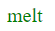

# Melt


Single file components on top of the html/template standard package.
<br>
<br>
[cheat-sheet.md](cheat-sheet.md)

## Table of Content
- [Imports](#imports)
- [Component Arguments](#component-arguments)
- [Child Components](#child-components)
- [Style](#style)
- [Watcher & Production](#watcher-&-production)

## Imports
```html
<!-- component.html -->
<div>hello!</div>
```
```html
<!-- index.html -->
<import>Component component.html</import>

<h1>component</h1>
<Component />
```
- Imports can be named anything but it has to start with a Uppercase Letter.

## Component Arguments
```html
<!-- hello.html -->
<div>hello {{ .Name }}!</div>
```
```html
<!-- number.html -->
<default>$number 0</default>

<div>the number is {{ $number }}</div>
```
```html
<!-- index.html -->
<import>Hello hello.html</import>
<import>Number number.html</import>

<Hello .Name="mqix" />

<Number />
<Number $number=13 />
```
### ```$```
- Just template variables.
- If you want to set a default you can do this by declaring
it like the example above in the number.html snippet.

### ```.```
- They work as normal but if you include a component that has used them it will be required that the value is passed in by execution unless they are passed as a component argument.

### constant values
If the the argument value is a constant (numbers and strings) it will replace the variable in the template with the value.

## Child Components
```html
<!-- component.html -->
<div>
  <-Title />
  <div>
    <Slot />
  </div>
</div>
```
```html
<!-- index.html -->
<import>Component component.html</import>

<Component -Title="<h1>im a title :)</h1>">
  <div>foo<div>
  <div>bar<div>
</Component>
```
### ```<Slot />```
- All html children get placed here.
### ```<-? />```
- Starts by a - and must be followed by a Uppercase Letter.
- The string from the argument with the same name gets placed here as html.


## Style
```go
m := melt.New(
  melt.WithStyle(true, "melt"),
)
```
Just scss powered by [**dart sass**](https://github.com/sass/dart-sass) with a little magic.

### Localization 
- Each component has its own style scope. this is done by adding a class to selected elements with the prefix and the component name.
- Escape of it by prefixing the selector with 
  - ```%s``` all inside component including imports (scoped)
  - ```%g``` every component with class name (global)
```html
<!-- Name.html -->
<div class="name">melt</div>

<style>
  .name { color: red }
</style>
```

```html
<!-- index.html -->
<import>Name name.html</import>

<Name />

<style>
  %g .name { color: green }
  %s .name { color: blue }
</style>
```
So this outputs the following.
<br>



<br>

```html
<div class="name melt-Name melt-scoped-Index">melt</div>
```
```css
.name.melt-Name { color: red }
.name.melt-scoped-Index { color:blue }
.color { color: green }
```

### note
- For this feature to work you must have [**dart sass**](https://github.com/sass/dart-sass) installed.
- Comments in stlye get removed in output.
- it sorts the output css in the following order.
  1. styles
  2. scoped styles
  2. styles without an melt prefix 